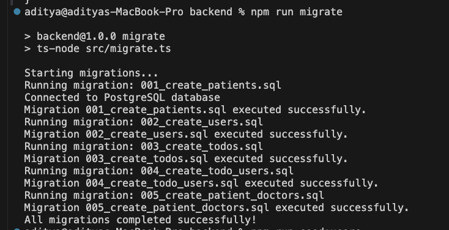
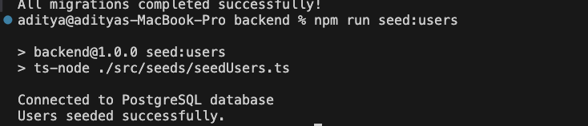
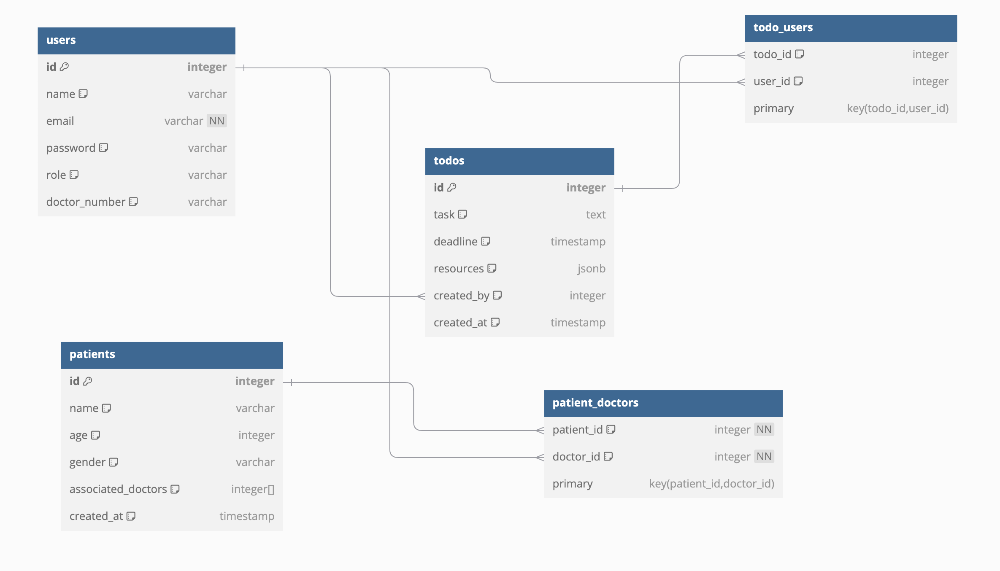

# Medical todo Application

A medical application that allows users to register, log in, and access various healthcare-related features.

## Table of Contents

1. [Prerequisites](#prerequisites)
2. [Setup Instructions](#setup-instructions)
3. [Database Migration and Seeding](#database-migration-seeding)
4. [Database Seeding](#database-seeding)
5. [Entity-Relationship Diagram (ERD)](#erd)
6. [Unit Testing](#unit-testing)
7. [Features](#features)

## Prerequisites

- **Node.js**: Ensure Node.js (>= 16.x) is installed on your machine.
- **Database**: PostgreSQL (>= 13.x) is required.
- **Package Manager**: npm or yarn.

## Setup Instructions

1. **Clone the Repository**:
   ```bash
   git clone https://github.com/Adityapfm99/medical-todo
   cd medical-app
   ```

2. **Install Dependencies**:
   ```bash
   npm install
   ```

3. **Configure Environment Variables**:
   Create a `.env` file in the root directory and configure the following variables:
   ```env
        DB_USER=
        DB_PASSWORD=
        DB_HOST=
        DB_PORT=
        DB_NAME=
        JWT_SECRET=
        JWT_SECRET=
   ```

4. **Start the Application**:
   ```bash
   npm start
   ```
   Access the application at `http://localhost:3000`.


## Database Migration and Seeding

1. **Run Migrations**:
   Create the necessary database tables using the provided migration scripts:
   ```bash
   npm run migrate
   ```
   

2. **Seed initial data**:
    Populate the database with initial data:
   ```bash
   npm run seed:users
   ```
   
   

## Entity-Relationship Diagram (ERD)
   Below is relationship diagram

   
   
   Explanation of Relationships

   ```bash

      Users and Todos:
      * A one-to-many relationship: Each user (creator) can create multiple todos. The created_by column in the todos table references the id column in the users table.
      Users and Todo_Users:
      * A many-to-many relationship: A todo can be assigned to multiple users, and a user can have multiple todos assigned to them. This relationship is represented by the todo_users table, which has foreign keys referencing both the users and todos tables.
      Patients and Users (Doctors):
      * A many-to-many relationship: Each patient can have multiple associated doctors, and each doctor can be associated with multiple patients. This is represented by the patient_doctors table, with foreign keys referencing patients and users.
      Patients:
      * The associated_doctors column in the patients table stores an array of doctor IDs. This provides quick access to associated doctors but is complemented by the patient_doctors table for maintaining integrity and relationships.
   ```
